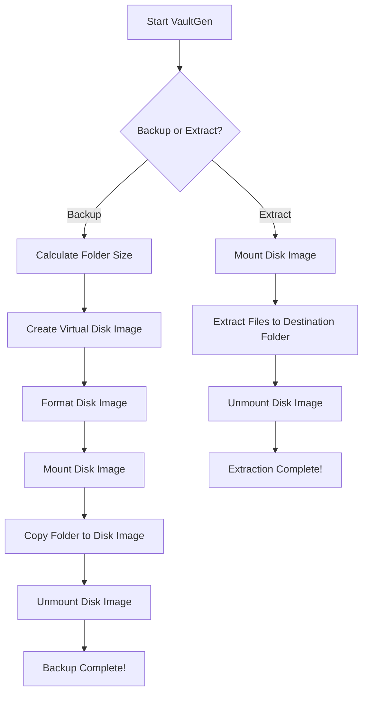

# VaultGen

Welcome to **VaultGen**! VaultGen is a lightweight, Python-based tool for creating backups as virtual disk images and extracting them when needed. It’s designed to make your data backup process straightforward and secure by generating virtual disk images where your data can be safely stored.

## How VaultGen Works

VaultGen works by taking a folder that you want to back up and generating a virtual disk image (like a `.img` file). It formats that image, copies your folder’s contents into it, and stores it securely. Later, you can extract the contents from that virtual disk image whenever you need them.

Here’s a simple **Mermaid graph** that explains the backup and extraction process:



## Features

- **Backup your data** into virtual disk images (.img) with ease.
- **Extract** the contents from the disk image to any destination folder when needed.
- Uses system tools like `mkfs` to format and `mount` for mounting/unmounting disk images.
- Visual progress tracking with the `rich` library to make the process friendly and fun to use.

## How to Use VaultGen

### 1. Install Dependencies

Before using VaultGen, make sure to install the required Python libraries and ensure your system supports the necessary commands (`mkfs.ext4`, `mount`, `umount`).

```bash
pip install rich pyfiglet
```
or
```bash
sudo pip3 install rich pyfiglet
```

ALSO you need to use WSL to run this in Windows.

### 2. Running VaultGen

VaultGen has two main operations: **backup** and **extract**. Here's how you can use it:

### Backup a Folder to a Disk Image

To backup a folder, you need to specify the folder you want to backup and the name of the disk image file that will be created.

```bash
sudo python3 vaultgen.py backup --folder /path/to/your/folder --image /path/to/virtual_backup.img
```

- `--folder`: This is the source folder you want to back up.
- `--image`: The path where you want to save the virtual disk image file (e.g., `virtual_backup.img`).
- `--mount`: (Optional) The directory used to temporarily mount the disk image (defaults to `/mnt/virtual_disk`).

### Extract a Folder from a Disk Image

When you want to extract the contents of a backup disk image, just specify the image and the destination folder where the contents will be extracted.

```bash
sudo python3 vaultgen.py extract --folder /path/to/extracted/folder --image /path/to/virtual_backup.img
```

- `--folder`: This is the destination folder where the extracted files will be placed.
- `--image`: The path to the virtual disk image file you want to extract from.
- `--mount`: (Optional) The directory used to temporarily mount the disk image (defaults to `/mnt/virtual_disk`).

### Arguments

| Argument   | Required | Description |
|------------|----------|-------------|
| `operation`| Yes      | Specifies whether you want to `backup` or `extract`. |
| `--folder` | Yes      | The source folder for backup or the destination folder for extraction. |
| `--image`  | Yes      | The path to the disk image file (either for creating or extracting from). |
| `--mount`  | No       | The temporary mount point for the disk image (defaults to `/mnt/virtual_disk`). |

## Example Usage

### Backup

To back up the folder `/mnt/d/BackUp` into a disk image `virtual_backup.img`, you would use:

```bash
sudo python3 vaultgen.py backup --folder /mnt/d/BackUp --image /mnt/d/virtual_backup.img
```

### Extract

To extract the contents of `virtual_backup.img` into a folder `/mnt/d/ExtractedData`, you would use:

```bash
sudo python3 vaultgen.py extract --folder /mnt/d/ExtractedData --image /mnt/d/virtual_backup.img
```

## How VaultGen Works (Detailed)

1. **Backup**: VaultGen calculates the size of the folder, creates a virtual disk image big enough to store that folder, formats the image, mounts it, copies the folder contents to the image, and unmounts the disk.
   
2. **Extract**: VaultGen mounts the disk image, copies the contents to your specified folder, and unmounts the disk afterward.
